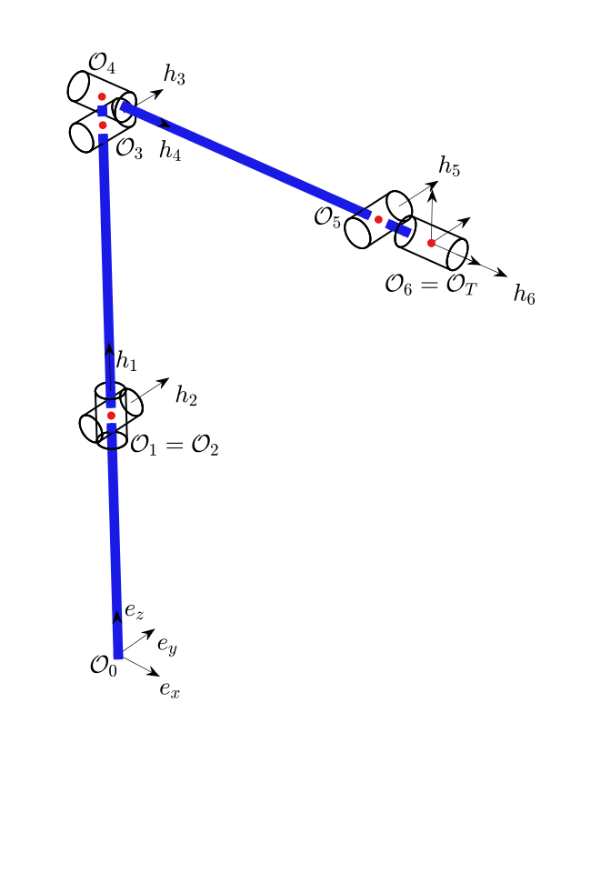

# com.robotraconteur.robot

Info file yaml entries for [com.robotraconteur.robot](../group1/com.robotraconteur.robot.md)

## RobotInfo

The `RobotInfo` structure is used to transmit information about articulated robots. This structure
can be used to represent most industrial robots. It is designed to support either single arms robots
or multi-arm robots.

An example `RobotInfo` yaml file is shown below:

```yaml
device_info:
  device:
    name: abb_robot
  manufacturer:
    name: ABB
    uuid: ee260e78-d731-415a-84ca-4b02c487410c
  model:
    name: ABB_1200_5_90
    uuid: 9ad3c0ee-ec5e-4057-a297-d340e1484f01
  user_description: ABB Robot
  serial_number: 123456789
  device_classes:
    - class_identifier:
        name: robot
        uuid: 39b513e7-21b9-4b49-8654-7537473030eb
      subclasses: 
        - serial
        - serial_six_axis        
  implemented_types:
    - com.robotraconteur.robotics.robot.Robot
robot_type: serial
robot_capabilities:
- jog_command
- trajectory_command
- position_command
chains:
- kin_chain_identifier: robot_arm
  H:
  - x: 0.0
    y: 0.0
    z: 1.0
  - x: 0.0
    y: 1.0
    z: 0.0
  - x: 0.0
    y: 1.0
    z: 0.0
  - x: 1.0
    y: 0.0
    z: 0.0
  - x: 0.0
    y: 1.0
    z: 0.0
  - x: 1.0
    y: 0.0
    z: 0.0
  P:
  - x: 0.0
    y: 0.0
    z: 0.3991
  - x: 0.0
    y: 0.0
    z: 0.0
  - x: 0.0
    y: 0.0
    z: 0.448
  - x: 0.0
    y: 0.0
    z: 0.042
  - x: 0.451
    y: 0.0
    z: 0.0
  - x: 0.082
    y: 0.0
    z: 0.0
  - x: 0.0
    y: 0.0
    z: 0.0
  flange_identifier: tool0
  flange_pose:
    orientation:
      w: 0.7071067811882787
      x: 0.0
      y: 0.7071067811848163
      z: 0.0
    position:
      x: 0.0
      y: 0.0
      z: 0.0
  joint_numbers:
  - 0
  - 1
  - 2
  - 3
  - 4
  - 5  
joint_info:
- default_effort_units: newton_meter
  default_units: radian
  joint_identifier: joint_1
  joint_limits:
    effort: 1000.0
    lower: -2.967
    upper: 2.967
    velocity: 5.027
    acceleration: 10
  joint_type: revolute
  passive: false
- default_effort_units: newton_meter
  default_units: radian
  joint_identifier: joint_2
  joint_limits:
    effort: 1000.0
    lower: -1.745
    upper: 2.269
    velocity: 4.189
    acceleration: 15
  joint_type: revolute
  passive: false
- default_effort_units: newton_meter
  default_units: radian
  joint_identifier: joint_3
  joint_limits:
    effort: 1000.0
    lower: -3.491
    upper: 1.222
    velocity: 5.236
    acceleration: 15
  joint_type: revolute
  passive: false
- default_effort_units: newton_meter
  default_units: radian
  joint_identifier: joint_4
  joint_limits:
    effort: 1000.0
    lower: -4.712
    upper: 4.712
    velocity: 6.981
    acceleration: 20
  joint_type: revolute
  passive: false
- default_effort_units: newton_meter
  default_units: radian
  joint_identifier: joint_5
  joint_limits:
    effort: 1000.0
    lower: -2.269
    upper: 2.269
    velocity: 7.069
    acceleration: 20
  joint_type: revolute
  passive: false
- default_effort_units: newton_meter
  default_units: radian
  joint_identifier: joint_6
  joint_limits:
    effort: 1000.0
    lower: -6.283
    upper: 6.283
    velocity: 10.472
    acceleration: 20
  joint_type: revolute
  passive: false
```

### device_info

Type: [DeviceInfo](../group1/com.robotraconteur.device.md#deviceinfo)

The device information for the robot.

### robot_type

Type: `string`

The type of robot. See the [RobotTypeCode](../group1/com.robotraconteur.robotics.robot.md#enum-robottypecode) enum 
for a list of standard robot types. Use the string representation of the enum value.

### joint_info

Type: List&lt;[JointInfo](joints.md#jointinfo)&gt;

A list containing joint information. The order of the joints in the list should match the order of the joints 
in the kinematic chain. If there are multiple kinematic chains, this list should contain all joints in all chaing.
Order them in the order they appear in the chains, with the first arm joints first.

### chains

Type: List&lt;[RobotKinChainInfo](#robotkinchaininfo)&gt;

The kinematic chains of the robot. A kinematic chain is a set of links and joints that form a chain of connected links.
An robot arm is one type of kinematic chain. A robot with multiple arms will have multiple kinematic chains.
The chain should be rooted at the base of the robot, and the last link should be the end effector. If multiple
arms contain the same links and joints, include them in both chains.

## robot_capabilities

Type: List&lt;`string`&gt;

A list of capabilities that are loaded into a bit-flag field in the `RobotInfo` structure. See
the [RobotCapabilityCode](../group1/com.robotraconteur.robotics.robot.md#enum-robotcapabilitycode) enum for a list of 
standard capabilities. Use the string representation of the enum value.

## signal_info

Type: List&lt;[SignalInfo](signal.md)&gt;

The input and output signals of the robot.

## parameter_info

Type: List&lt;[ParameterInfo](param.md)&gt;

The parameters that can be get/set using the `getf_param` and `setf_param` functions.

This field is usually populated by the driver, and is not typically configured using the YAML file.

## RobotKinChainInfo

The `RobotKinChainInfo` structure is used to represent a kinematic chain of a robot. It contains the
geometric information of the chain, such as the links and joints. The joints are stored
in the `joint_info` structure in the `RobotInfo` structure, and referred to by the `joint_numbers` field
indexing the `joint_info` list (0-based index). If multiple kinematic chains contain the same joints, they
can use the same joint numbers. Each kinematic chain is rooted at the base of the robot, and the last link
should be the end effector. If the robot has multiple arms and share joints and links toward the base of the robot,
include them in both chains until the arms diverge.

The `RobotKinChainInfo` structure uses "product-of-exponential" representation of the kinematic chain. 
This representation uses an "H" matrix and a "P" vector to represent the kinematic chain. The "H" matrix
contains the unit vector of the joint axes and the "P" vector contains the position of the joint in the
previous joint's coordinate system. It is assumed that all link frames are identical when all joints are zero.
The `flange_pose` field contains the pose of the end effector in the last joint's coordinate system. "H" has
 the same number of entries as the number of joints in the chain, and "P" has one more entry than the number of joints.

The diagram below shows the geometry of the IRB1200 robot arm. The "H" components in the diagram
are `H=[h1,h2,h3,h4,h5,h6]` and the "P" components are `P=[(O1-O0),(O2-O1),(O3-O2),(O4-O3),(O5-O4),(O6-O5),and (OT-O6)]`.
The values for a robot are tyically obtained from the robot 
[manufacturer's documentation](https://search.abb.com/library/Download.aspx?DocumentID=9AKK106103A6066&LanguageCode=en&DocumentPartId=&Action=Launch).



A simple tool `urdf_to_robotinfo.py` is provided in the `tools/` directory of this repository to convert a URDF file
to a `RobotInfo` structure. The URDF must be processed through xacro before running the tool if it uses xacro macros.
*Warning: This script is not guaranteed to produce accurate results, and is not guaranteed to work with all URDF files.
it is a simple tool to help begin the process of converting a URDF file to a robotinfo.yaml file.*

 <!--TODO: add diagram -->

### kin_chain_identifier

Type: [Identifier](identifier.md)

An identifier for the kinematic chain. Can be empty if not needed.

### H

Type: List&lt;[Vector3](geometry.md#vector3)&gt;

The "H" matrix of the kinematic chain. The "H" matrix contains the unit vector of the joint axes.

### P

Type: List&lt;[Vector3](geometry.md#vector3)&gt;

The "P" vector of the kinematic chain. The "P" vector contains the position of the 
joints in the previous joints' coordinate system.

### link_inertias

Type: List&lt;[SpatialInertia](geometry.md#spatialinertia)&gt;

The inertias of the links in the kinematic chain for dynamic calculations.

### link_fiducials

Type: List&lt;[LinkFiducial](fiducial.md)&gt;

The fiducials of the links in the kinematic chain for calibration and tracking.

### joint_numbers

Type: List&lt;`int`&gt;

The joint numbers of the kinematic chain. The joint numbers index the `joint_info` list in the `RobotInfo` structure
(0-index).

### flange_pose

Type: [Pose](geometry.md)

The pose of the end effector mounting flange in the last joint's coordinate system. The tool will have
another pose relative to the flange.

### flange_identifier

Type: [Identifier](identifier.md)

An identifier for the flange. Can be empty if not needed.

### current_tool

Type: [ToolInfo](tool.md)

The current tool attached to the flange. Can be empty if no tool is attached. This field
will be updated by the driver if a tool is changed.

### current_payload

Type: [PayloadInfo](payload.md)

The current payload attached to the flange. Can be empty if no payload is attached. This field
will be updated by the driver if a payload is changed.

### tcp_max_velocity

Type: [SpatialVelocity](geometry.md)

The maximum velocity of the tool center point (TCP) in the last flange coordinate system.

### tcp_max_acceleration

Type: [SpatialAcceleration](geometry.md)

The maximum acceleration of the tool center point (TCP) in the last flange coordinate system.

### tcp_reduced_max_velocity

Type: [SpatialVelocity](geometry.md)

The maximum velocity of the tool center point (TCP) in the last flange coordinate system when the robot is 
in reduced velocity mode such as jogging.

### tcp_reduced_max_acceleration

Type: [SpatialAcceleration](geometry.md)

The maximum acceleration of the tool center point (TCP) in the last flange coordinate system when the robot is
in reduced velocity mode such as jogging.

### description

Type: `string`

A user configured description of the kinematic chain.

### extended

Type: [Extended](extended.md)

Extended information.
